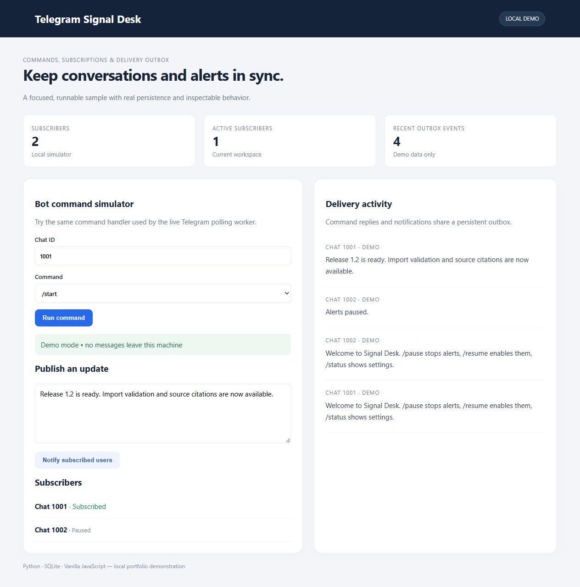

# Telegram Signal Desk

Keep conversations and alerts in sync. Commands, subscriptions & delivery outbox.



## Run locally

Python 3.12 or newer:

```sh
python -m venv .venv
# Windows: .venv\Scripts\activate
# Linux/macOS: source .venv/bin/activate
python -m pip install -r requirements.txt
python server.py
```

Open http://127.0.0.1:8765. Set `PORT` to use a different port.

## Tests

```sh
python -m unittest discover -s tests -v
```

## Structure

- `engine.py`: application rules and SQLite persistence.
- `server.py`: local HTTP adapter, bounded JSON requests and origin checks.
- `index.html`: responsive interface; untrusted text is escaped before rendering.
- `tests/`: behavior tests using temporary databases.

## Scope

This is a local, single-user portfolio demonstration. It binds to loopback and has no public account system. Do not expose it directly to the internet. Authentication, access isolation, quotas, monitoring and deployment hardening are separate work. Secrets and local databases are excluded from Git.

## Simulator and live mode

Run `/start`, `/pause`, `/resume` and `/status` in the dashboard simulator. Broadcasts target subscribed chats only. The simulator records events without contacting Telegram.

For your own test bot, set `TELEGRAM_BOT_TOKEN` in the environment of both server and worker, then run `python worker.py` in the same directory. Create the token through BotFather yourself. No token is included here. Long polling requires removing any pre-existing webhook. See the [Telegram Bot API](https://core.telegram.org/bots/api).

Incoming updates are deduplicated and a reply is persisted before advancing the polling offset. The worker retries pending outbox events. Delivery is **at least once**: a crash after Telegram accepts a message but before SQLite records success can cause a duplicate. Run one worker per database. Live transport has mocked tests; no real bot credentials are bundled or used for the demo screenshots.
